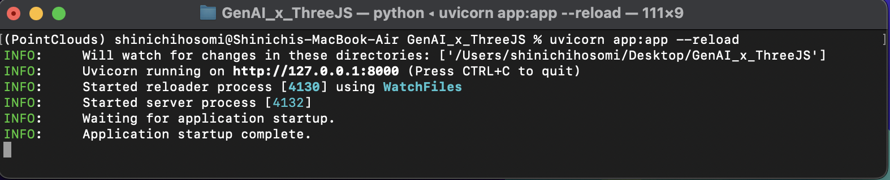
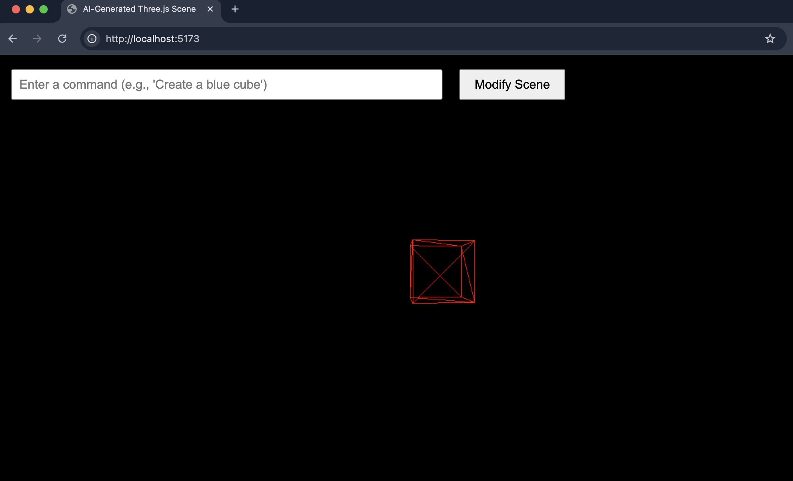

# 3D rendering automated by OpenAI

This website automatically generates 3D rendering from high-level natural language by communicating with OpenAI.
A natural language command is entered into a text box at the top of the website, and clicking the "Modify scene" button triggers a message to a server (app.py). The server interprets the command and dynamically generates the corresponding Three.js script. The new script is fetched on the client, and the 3D view is instantly updated. 

[](https://www.youtube.com/watch?v=Eq8SnbMB7-o)

## Protocol to OpenAI

OpenAI requires an API key, a model name, and a set of messages.

The message defines the conversation history sent to the model. 

In this code, the message includes the role, tasks and restrictions, examples, prohibited conditions, and user command.

  ```Python
            messages=[
                {"role": "system", "content": (
                    # a role of OpenAI
                    "You are a JavaScript coding assistant. "
                    # task & restrictions
                    "ONLY return valid Three.js object creation code. "
                    # examples
                    "follow below formats as an example"
                    "const geometry = new THREE.BoxGeometry();"
                    "const material = new THREE.MeshBasicMaterial({ color: 0x00ff00 });"
                    "const cube = new THREE.Mesh(geometry, material);"
                    "cube.position.set(0, 0, 0);"
                    "scene.add(cube);"
                    # prohibited conditions
                    "DO NOT redeclare `scene`, `camera`, or `renderer`."
                    "DO NOT generate ```javascript before script"
                    "DO NOT generate ```after script"
                )},
                # user command
                {"role": "user", "content": f"Create a Three.js scene with: {user_command}"}
            ],
  ```

## How to run

First, open a terminal to execute the following code to run a FastAPI web application using Uvicorn, an ASGI web server. 

<pre><code>
cd GenAIxThreeJS
uvicorn app:app --reload; 
</code></pre>

If both OpenAI API and the name of the model are properly set up, a terminal will display the following output. 

<p align="left">
  
</p>


Second, open another terminal to run the following command telling Node.js to run a custom script named dev that's defined in the project.

<pre><code>
npm run dev
</code></pre>

Finally, open a web browser, and enter http://localhost:5173/ to an address bar, which results in opening the website displaying a rotating red cube.

<p align="left">
  
</p>
  